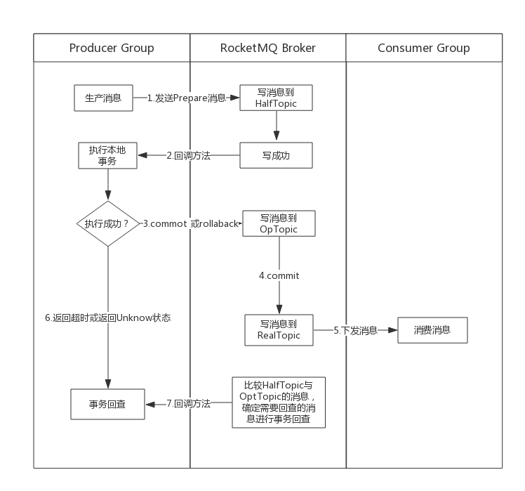
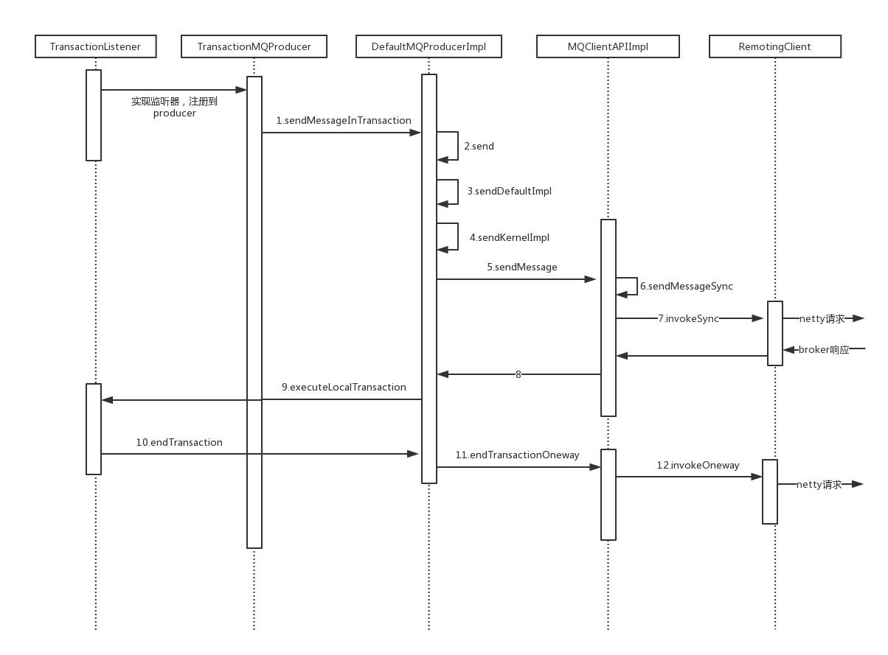
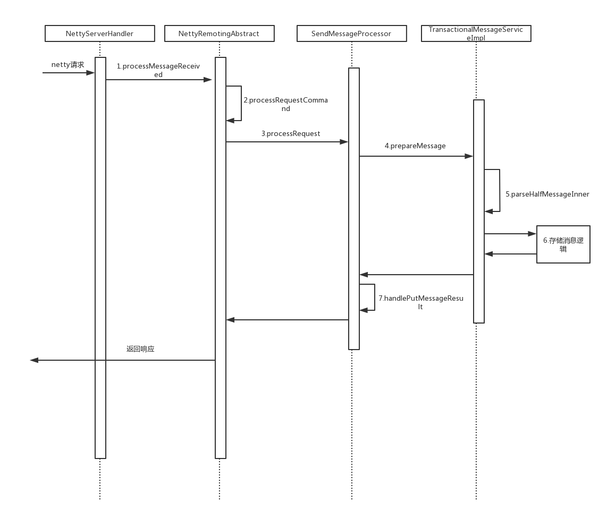
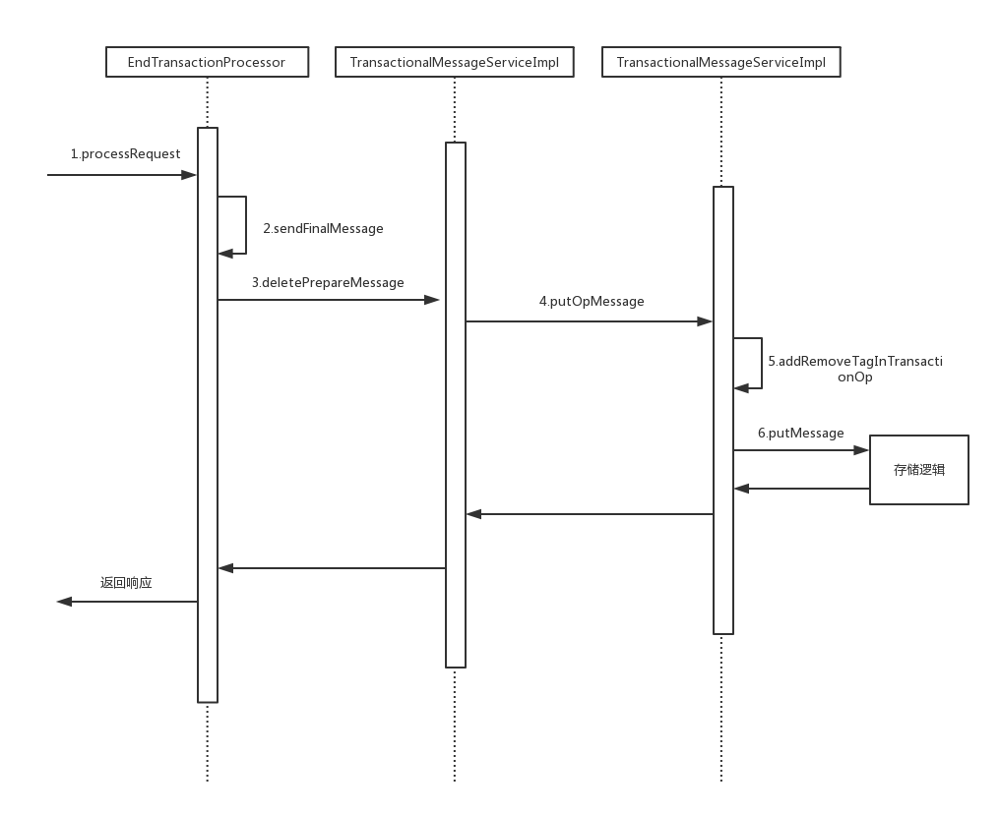
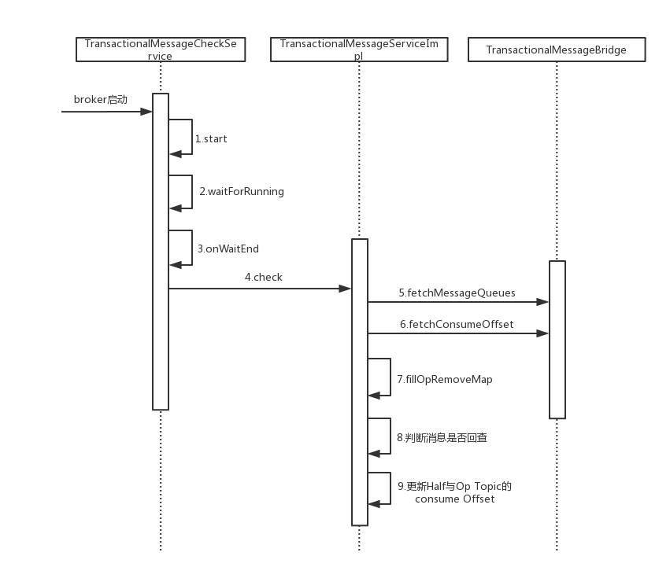

## RocketMQ是如何实现事务消息的

### 前言

在RocketMQ4.3.0版本后，开放了事务消息这一特性，对于分布式事务而言，最常说的还是[二阶段提交协议](https://sq.163yun.com/blog/article/165554812476866560)，那么RocketMQ的事务消息又是怎么一回事呢，这里主要带着以下几个问题来探究一下RocketMQ的事务消息：

* 事务消息是如何实现的
* 我们有哪些手段来监控事务消息的状态
* 事务消息的异常恢复机制

###RocketMQ的事务消息是如何实现的

RocketMQ作为一款消息中间件，主要作用就是帮助各个系统进行业务解耦，以及对消息流量有削峰填谷的作用，而对于事务消息，主要是通过消息的异步处理，可以保证本地事务和消息发送同时成功执行或失败，从而保证数据的最终一致性，这里我们先看看一条事务消息从诞生到结束的整个时间线流程：



1. 生产者发送消息到broker,该消息是prepare消息，且事务消息的发送是同步发送的方式。
2. broker接收到消息后，会将该消息进行转换，所有的事务消息统一写入Half Topic，该Topic默认是**RMQ_SYS_TRANS_HALF_TOPIC** ,写入成功后会给生产者返回成功状态。
3. 本地生产获取到该消息的事务Id，进行本地事务处理。
4. 本地事务执行成功提交Commit，失败则提交Rollback,超时提交或提交Unknow状态则会触发broker的事务回查。
5. 若提交了Commit或Rollback状态，Broker则会将该消息写入到Op Topic,该Topic默认是**RMQ_SYS_TRANS_OP_HALF_TOPIC**，该Topic的作用主要记录已经Commit或Rollback的prepare消息，Broker利用Half Topic和Op Topic计算出需要回查的事务消息。如果是commit消息，broker还会将消息从Half取出来存储到真正的Topic里，从而消费者可以正常进行消费，如果是Rollback则不进行其他操作
6. 如果本地事务执行超时或返回了Unknow状态，则broker会进行事务回查。若生产者执行本地事务超过6s则进行第一次事务回查，总共回查15次，后续回查间隔时间是60s，broker在每次回查时会将消息再在Half Topic写一次。回查次数和时间间隔都是可配置的。
7. 执行事务回查时，生产者可以获取到事务Id，检查该事务在本地执行情况，返回状态同第一次执行本地事务一样。

从上述流程可以看到事务消息其实只是保证了**生产者发送消息成功与本地执行事务的成功的一致性**，消费者在消费事务消息时，broker处理事务消息的消费与普通消息是一样的，若消费不成功，则broker会重复投递该消息16次，若仍然不成功则需要人工介入。

事务消息的成功投递是需要经历三个Topic的，分别是：

* **Half Topic**：用于记录所有的prepare消息
* **Op Half Topic**：记录已经提交了状态的prepare消息
* **Real Topic**：事务消息真正的Topic,在Commit后会才会将消息写入该Topic，从而进行消息的投递

理解清楚事务消息在这三个Topic的流转就基本理解清楚了RocketMQ的事务消息的处理。接下来我们看看在源码中是如何使用这三个Topic的。

#### 1.生产发送prepare消息




1. 事务消息的生产者需要构造一个线程池与一个实现了TransactionListener的实现类，并注册到TransactionMQProducer中，先看下TransactionListener的方法及作用：

   ```java
   public interface TransactionListener {
       /**
        * 发送prepare消息成功后回调该方法用于执行本地事务
        * @param msg 回传的消息，利用transactionId即可获取到该消息的唯一Id
        * @param arg 调用send方法时传递的参数，当send时候若有额外的参数可以传递到send方法中，这里能获取到
        * @return 返回事务状态，COMMIT：提交  ROLLBACK：回滚  UNKNOW：回调
        */
       LocalTransactionState executeLocalTransaction(final Message msg, final Object arg);
       /**
        * @param msg 通过获取transactionId来判断这条消息的本地事务执行状态
        * @return 返回事务状态，COMMIT：提交  ROLLBACK：回滚  UNKNOW：回调
        */
       LocalTransactionState checkLocalTransaction(final MessageExt msg);
   }
   ```

   在`sendMessageInTransaction`方法中，主要有：

   * 调用`Validators.checkMessage(msg, this.defaultMQProducer)`校验事务消息的合法性

   * 对消息设置`PROPERTY_TRANSACTION_PREPARED`与`PROPERTY_PRODUCER_GROUP`属性，前者用于判断该消息是prepare消息，后者主要在回查时需要用到。

   * 调用DefaultMQProducerImpl的`send`方法进行发送。

2. `send`方法以同步方式调用`sendDefaultImpl`方法

3. `sendDefaultImpl`方法的作用主要用：

   * 获取对应的Topic的路由
   * 轮询获取需要发送的队列（在3.2.6版本中这里轮询有个Bug~,轮询次数超过Integer.MAX时会开始报错）

   * 调用`sendKernelImpl`进行消息发送

4. `sendKernelImpl`方法主要设置了消息的`TRANSACTION_PREPARED_TYPE`标志以及调用MQClientAPIImpl的`sendMessage`方法

5. 最终会调用到通信层的`RemotingClient`类进行消息的发送，并接收broker的响应

6. 收到响应后返回到`sendMessageInTransaction`方法中执行后序的逻辑：

   * 判断响应状态，如果是SNED_OK，就执行 `transactionListener.executeLocalTransaction(msg, arg)`方法来执行本地事务逻辑
   * 如果是其他状态，对该消息进行回滚：返回RALLBACK状态
   * 构造`TransactionSendResult`对象并返回。

7. 在第6步中返回`TransactionSendResult`之前，会调用`this.endTransaction(sendResult, localTransactionState, localException)`方法，该方法的作用就是向broker返回本地事务状态。

#### 2. Broker处理prepare消息



1. NettyServerHandler类的`processMessageReceived` 方法是所有broker请求的入口，该方法会调用NettyRemotingAbstract方法的`processMessageReceived`方法。
2. NettyRemotingAbstract的`processMessageReceived`通过命令模式根据cmd的code获取到对应的processor进行请求的处理，事务prepare消息对应的processor是SendMessageProcessor
3. SendMessageProcessor的`processRequest`方法会根据判断是否是批量消息，事务的prepare消息是单条的，调用其`sendMessage`方法，该方法中有一块单独处理事务消息的逻辑：

```java
//判断是否是事务消息 如果是事务消息则用事务消息的逻辑处理
String traFlag = oriProps.get(MessageConst.PROPERTY_TRANSACTION_PREPARED);
if (traFlag != null && Boolean.parseBoolean(traFlag)) {
    if (this.brokerController.getBrokerConfig().isRejectTransactionMessage()) {
        response.setCode(ResponseCode.NO_PERMISSION);
        response.setRemark(
            "the broker[" + this.brokerController.getBrokerConfig().getBrokerIP1()
                + "] sending transaction message is forbidden");
        return response;
    }
    putMessageResult = this.brokerController.getTransactionalMessageService().prepareMessage(msgInner);
} else {
    putMessageResult = this.brokerController.getMessageStore().putMessage(msgInner);
}
```

4.对于prepare消息会调用TransactionMessageBridge的`putHalfMessage`方法，该方法调用`parseHalfMessageInner`对prepare消息进行转换并在转换后进行消息的存储：

```java
public PutMessageResult putHalfMessage(MessageExtBrokerInner messageInner) {
    return store.putMessage(parseHalfMessageInner(messageInner));
}
```

```java
/**
 * 将消息进行转换，最终将消息存储到统一处理事务的Topic中：RMQ_SYS_TRANS_HALF_TOPIC
 * @return 转换后的消息
 */
private MessageExtBrokerInner parseHalfMessageInner(MessageExtBrokerInner msgInner) {
    //将消息所属真正Topic存储到消息的properties中
    MessageAccessor.putProperty(msgInner, MessageConst.PROPERTY_REAL_TOPIC, msgInner.getTopic());
    //将消息应该写的queue存储到消息的properties中
    MessageAccessor.putProperty(msgInner, MessageConst.PROPERTY_REAL_QUEUE_ID,
        String.valueOf(msgInner.getQueueId()));
    //设置事务消息标志：Unknow，因为现在还没有接收到该事务消息的状态
    msgInner.setSysFlag(
        MessageSysFlag.resetTransactionValue(msgInner.getSysFlag(), MessageSysFlag.TRANSACTION_NOT_TYPE));
    //设置消息存储到的Topic:统一事务消息Topic:RMQ_SYS_TRANS_HALF_TOPIC
    msgInner.setTopic(TransactionalMessageUtil.buildHalfTopic());
    //所有事务消息存放在该Topic的第一个队列里
    msgInner.setQueueId(0);
    //将其余该消息的属性统一存放进来
  msgInner.setPropertiesString(MessageDecoder.messageProperties2String(msgInner.getProperties()));
    return msgInner;
}
```

5.可以看到所有的prepare消息都是存储在一个Topic中的一个队列里，该Topic就是上面的**Half Topic**，最后会对消息进行存储逻辑的操作，并调用`handlePutMessageResult`构造返回结果返回给生产者。

#### 3.Broker结束事务消息



1. 生产者在发送prepare消息后—>执行本地事务逻辑—>broker接收请求结束本次事务状态：Broker在接收请求后根据命令会执行`EndTransactionProcessor`的`processRequest`方法，该方法中下面的逻辑是真正处理事务消息状态的：

   ```java
   OperationResult result = new OperationResult();
   if (MessageSysFlag.TRANSACTION_COMMIT_TYPE == requestHeader.getCommitOrRollback()) {
       // 获取Half Topic中的prepare消息
       result = this.brokerController.getTransactionalMessageService().commitMessage(requestHeader);
       if (result.getResponseCode() == ResponseCode.SUCCESS) {
           // 校验消息是否正确：Half中的该消息是不是真正的本次请求处理的消息
           RemotingCommand res = checkPrepareMessage(result.getPrepareMessage(), requestHeader);
           if (res.getCode() == ResponseCode.SUCCESS) {
               // 将prepare消息转换为原消息，该消息的Topic就是真正消息的Topic
               MessageExtBrokerInner msgInner = endMessageTransaction(result.getPrepareMessage());
               msgInner.setSysFlag(MessageSysFlag.resetTransactionValue(msgInner.getSysFlag(), requestHeader.getCommitOrRollback()));
               msgInner.setQueueOffset(requestHeader.getTranStateTableOffset());
               msgInner.setPreparedTransactionOffset(requestHeader.getCommitLogOffset());
               msgInner.setStoreTimestamp(result.getPrepareMessage().getStoreTimestamp());
               //将消息发送到真正的Topic里，该消息可以开始下发给消费者
               RemotingCommand sendResult = sendFinalMessage(msgInner);
               if (sendResult.getCode() == ResponseCode.SUCCESS) {
                   //将消息放入Op Half Topic
                   this.brokerController.getTransactionalMessageService().deletePrepareMessage(result.getPrepareMessage());
               }
               return sendResult;
           }
           return res;
       }
   } else if (MessageSysFlag.TRANSACTION_ROLLBACK_TYPE == requestHeader.getCommitOrRollback()) {
       //同commitMessage方法一样，返回真正的操作的消息：将Half Topic中的该消息还原为原消息
       result = this.brokerController.getTransactionalMessageService().rollbackMessage(requestHeader);
       if (result.getResponseCode() == ResponseCode.SUCCESS) {
           RemotingCommand res = checkPrepareMessage(result.getPrepareMessage(), requestHeader);
           if (res.getCode() == ResponseCode.SUCCESS) {
               //将消息放入Op Half Topic
               this.brokerController.getTransactionalMessageService().deletePrepareMessage(result.getPrepareMessage());
           }
           return res;
       }
   }
   ```

2. 该方法会判断本次事务的最终状态，如果是Commit：
   * 获取**Half Topic**中的消息
   * 将该消息转换为原消息
   * 将消息写入到真正的Topic里，这里是事务消息的真正落盘，从而消息可以被消费者消费到
   * 如果落盘成功，则删除prepare消息，其实是将消息写入到**Op Topic**里，该消息的内容就是这条消息在**Half Topic**队列里的offset，原因见后面的分析
3. 如果是Rollback，则直接将消息转换为原消息，并写入到**Op Topic**里

#### 4.事务消息是如何处理回查的

在RocketMQ中，消息都是顺序写随机读的，以offset来记录消息的存储位置与消费位置，所以对于事务消息的prepare消息来说，不可能做到物理删除，broker启动时每间隔60s会开始检查一下有哪些prepare消息需要回查，从上面的分析我们知道，所有prepare消息都存储在**Half Topic**中，那么如何从该Topic中取出需要回查的消息进行回查呢？这就需要**Op Half Topic**以及一个内部的消费进度计算出需要回查的prepare消息进行回查：

* **Half Topic** 默认Topic是**RMQ_SYS_TRANS_HALF_TOPIC**，建一个队列，存储所有的prepare消息
* **Op Half Topic**默认是**RMQ_SYS_TRANS_OP_HALF_TOPIC**，建立的对列数与**Half Topic**相同，存储所有已经确定状态的prepare消息（rollback与commit状态），消息内容是该条消息在**Half Topic**的Offset
* **Half Topic消费进度**，默认消费者是**CID_RMQ_SYS_TRANS**，每次取prepare消息判断回查时，从该消费进度开始依次获取消息。
* **Op Half Topic消费进度**，默认消费者是**CID_RMQ_SYS_TRANS**，每次获取prepare消息都需要判断是否在Op Topic中已存在该消息了，若存在表示该prepare消息已结束流程，不需要再进行事务回查，每次判断都是从Op Topic中获取一定消息数量出来进行对比的，获取的消息就是从Op Topic中该消费进度开始获取的，最大一次获取32条。

下面看一下大致的时间线：



1. broker在启动时会启动线程回查的服务，在`TransactionMessageCheckService`的`run`方法中，该方法会执行到onWaitEnd方法：

```java
@Override
protected void onWaitEnd() {
    //获取超时时间 6s
    long timeout = brokerController.getBrokerConfig().getTransactionTimeOut();
    //获取最大检测次数 15次
    int checkMax = brokerController.getBrokerConfig().getTransactionCheckMax();
    //获取当前时间
    long begin = System.currentTimeMillis();
    log.info("Begin to check prepare message, begin time:{}", begin);
    //开始检测
    this.brokerController.getTransactionalMessageService().check(timeout, checkMax, this.brokerController.getTransactionalMessageCheckListener());
    log.info("End to check prepare message, consumed time:{}", System.currentTimeMillis() - begin);
}
```

2. 该方法的最后会执行到`TransactionMessageServiceImpl`的`check`方法，该方法就是真正执行事务回查检测的方法，该方法的主要作用就是计算出需要回查的prepare消息进行事务回查，大致逻辑是：
   * 获取**Half Topic**的所有队列，循环队列开始检测需要获取的prepare消息，实际上**Half Topic**只有一个队列。
   * 获取**Half Topic**与**Op Half Topic**的消费进度。
   * 调用`fillOpRemoveMap`方法，获取**Op Half Topic**中已完成的prepare事务消息。
   * 从**Half Topic**中当前消费进度依次获取消息，与第3步获取的已结束的prepare消息进行对比，判断是否进行回查：
   * 如果Op消息中包含该消息，则不进行回查，
   * 如果不包含，获取**Half Topic**中的该消息，判断写入时间是否符合回查条件，若是新消息则不处理下次处理，并将消息重新写入**Half Topic**，判断回查次数是否小于15次，写入时间是否小于72h，如果不满足就丢弃消息，若满足则更新回查次数，并将消息重新写入**Half Topic**并进行事务回查，
   * 在循环完后重新更新**Half Topic**与**Op Half Topic**中的消费进度，下次判断回查逻辑时，将从最新的消费进度获取信息。

3. 生产客户端的`ClientRemotingProcessor`的`processRequest`方法会处理服务端的`CHECK_TRANSACTION_STATE`请求，最后会调用`checkLocalTransactionState`方法，该方法就是业务方可以自己实现事务消息回查逻辑的地方，并将结果最后用`endTransactionOneway`方法返回给Broker，该执行逻辑可以通过`ClientRemotingProcessor`的方法`processRequest`依次理解就可以了。

### 我们有哪些手段来监控事务消息的状态

通过上面的文章，可以大致了解事务消息的实现，我们可以知道，事务消息主要有三个状态：

* **UNKNOW**状态：表示事务消息未确定，可能是业务方执行本地事务逻辑时间耗时过长或者网络原因等引起的，该状态会导致broker对事务消息进行回查，默认回查总次数是15次，第一次回查间隔时间是6s，后续每次间隔60s,
* **ROLLBACK**状态，该状态表示该事务消息被回滚，因为本地事务逻辑执行失败导致
* **COMMIT**状态，表示事务消息被提交，会被正确分发给消费者。

那么监控事务消息时，主要是查看该事务消息是否是处于我们想要的状态，而在事务消息生产者发送prepare消息成功后只能拿到一个transactionId，该id不是的RocketMQ消息存储的物理offset地址，RocketMQ只有在准备写入commitlog文件时才会生成真正的msgId，而这里可以获取的transactionId和msgId都是客户端生成的一个消息的唯一标识符，我们在这里称为uniqId，在broker端，会把该uniqId作为一个msgKey写入消息，所以可以通过该uniqId来查找uniqId的一些状态：

1. 通过`DefaultMQAdminExt`的`viewMessage(String topic, String msgId)`方法可以消息的信息，这里topic参数是**RMQ_SYS_TRANS_HALF_TOPIC** ，该topic是真正的Half Topic，msgId传发送prepare消息获取的uniqId，这样可以获取prepare消息在Half Topic真正的offsetMsgId，
2. 通过第一步获取的offsetMsgId继续调用`viewMessage(String topic, String msgId)`方法，但是topic是**RMQ_SYS_TRANS_OP_HALF_TOPIC**，这样可以获取Op Half Topic中该事务消息的状态，如果存在说明prepare消息已处理，否则可能仍在回查中或已被丢弃
3. 如果在第二步查到了信息可以用uniqId和事务消息真正Topic继续调用`viewMessage(String topic, String msgId)`方法获取消息真正的信息，如果存在说明消息已被投递，否则该事务消息已被回滚。只通过Op Half Topic是不能确定消息状态的，这里的sysFlag被设置0，sysFlag是用于确定事务消息状态。

通过上述三步就可以确定事务消息的状态。

### 事务消息的异常恢复机制

事务消息的异常状态主要有：

1. 生产者提交prepare消息到broker成功，但是当前生产者实例宕机了
2. 生产者提交prepare消息到broker失败，可能是因为提交的broker已宕机
3. 生产者提交prepare消息到broker成功，执行本地事务逻辑成功，但是broker宕机了未确定事务状态
4. 生产提交prepare消息到broker成功，但是在进行事务回查的过程中broker宕机了，未确定事务状态

对于1：事务消息会根据producerGroup搜寻其他的生产者实例进行回查，所以transactionId务必保存在中央存储中，并且事务消息的pid不能跟其他消息的pid混用。

对于2：当前实例会搜寻其他的可用的broker-master进行提交，因为只有提交prepare消息后才会执行本地事务，所以没有影响，注意生产者报的是超时异常时，是不会进行重发的。

对于3：因为返回状态是`oneway`方式，此时如果消费者未收到消息，需要用手段确定该事务消息的状态，尽快将broker重启，broker重启后会通过回查完成事务消息。

对于4：同3，尽快重启broker。


