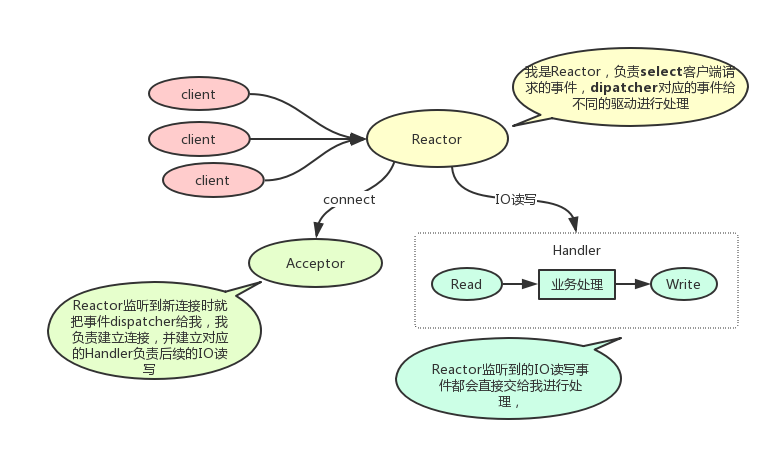
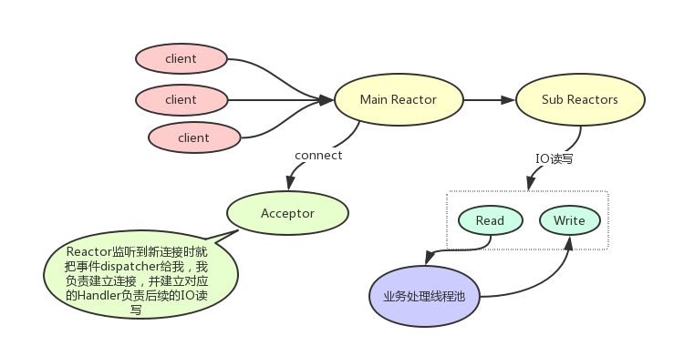
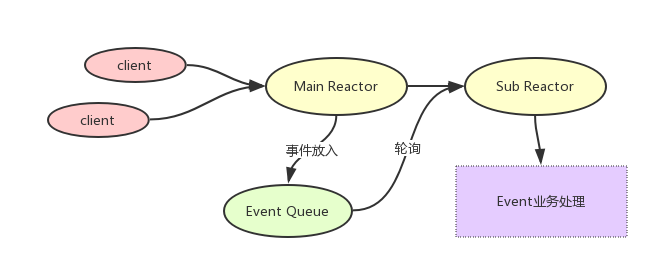

### 高性能Reactor模式概述与实践

#### 概述

什么是Reactor模式呢？翻译成中文是“反应者”模式，一般称为“事件驱动”模式，在单机高性能开发时，能很好的提高系统单机性能。Reactor模式主要有以下几种：

* 单Reactor单线程：大家经常使用的redis就是这样处理其IO事件的
* 单Reactor多线程：Java中的NIO的处理，Netty服务中只设置了BossEventLoopGroup（可以理解为就是一个线程池）且值为1时，内部运行就是该模式。
* 多Reactor多线程：Netty服务中设置了BossEventLoopGroup和WorkerEventLoopGroup,就是该模式，例如：RocketMQ中的netty组件与IoT MQ中就会同时设置这两个值，并且IoT MQ的BossEventLoopGroup设置的要更大一些。

在学习和理解Reactor模式时，先看看以下几个概念：

1. 事件：什么是事件，比如IO中的accept，connect，read，write就是不同的事件。
2. Reactor：反应堆，可以理解为就是事件驱动，Reactor监听（轮询或通知）到事件后，根据事件进行不同的处理。
3. 工作线程：Reactor在监听到事件后，会将事件交给不同的handler（具体处理逻辑的东东），交给工作线程进行后续的处理。

#### 单Reactor单线程



可以看出，Reactor主要是监听事件并dispatcher到不同的事件处理器进行处理的。对于单Reactor单线程模式，优点是：

1. 实现相对简单
2. 单线程（单进程）执行所有的逻辑，没有线程（进程）切换的开销

缺点是：

对于连接，IO频繁时，性能不够，特别是IO读写比较耗性能，如果当前执行IO读写阻塞了，那么对于新的连接不能进行连接，其余的IO读写操作也会被阻塞。

例如Redis就是这种IO模式，如果执行`keys *`这种时间复杂度为O(n)的操作，会非常影响redis的性能。

#### 单Reactor多线程


如图，相对于单Reactor单线程，主要将IO的业务处理剥离出来，单独用子线程池处理业务逻辑。

优点是：

IO读写handler不再处理业务逻辑，只响应事件并将数据交给业务处理线程池处理，IO读写不再阻塞，提高IO响应的性能。

缺点是：

1. IO读写时，具体业务操作需要交给业务处理线程池做，期间会涉及到线程的切换，增加一部分消耗，同时对于业务处理线程池可能也处理比较慢，需要做限流等处理。
2. Reactor要同时响应所有的事件，如果IO连接，读写都很多，那么IO的读写会降低一部分新连接建立的处理

#### 多Reactor多线程



多Reactor多线程在netty中使用最多，如果netty的Boss线程（Main Reactor）与Worker（Sub Reactor）都设置了，其内部的IO模型就是多Reactor多线程模式。

* Main Reactor：主要负责监听新连接事件，监听到新连接事件后交给Acceptor处理（也可能是Main Reactor监听了就自己处理了），然后Acceptor建立对应的IO读写handler，Main Reactor将建立好的连接交给Sub Reactor处理。
* Sub Reactor：这里监听的都是已经建立好的连接，主要是监听IO读写事件，然后响应给handler进行后续的IO处理。

多Reactor多线程就是增加了一个Sub Reactor反应堆（可以理解为一个线程池）单独处理IO读写。减少对新连接响应的影响。

#### Netty应用与实践

上面介绍了Reactor模型以及其优缺点，那么对于实际应用中，如何利用Reactor模型呢？

这里先以Netty的实际应用为例：

现在有两个产品，RocketMQ与IoT MQ，它们内部通信层模块都采用netty组件作为底层实现，两个MQ的共同需求（性能）都是需要：高性能，高读写IO。不同点是：

* 对于RocketMQ，连接主要是系统级的，连接数较少，一台broker几千的连接已经很高了，但是IO读写很多，主要是消息的收发
* 对于IoT MQ，主要是针对物联网设备的，设备数很多同时网络不好可能会导致频繁的重连，消息大小比较小，同时总体消息量比较大。所以IoT MQ对IO连接，IO读写都有很高的要求。

综上，RocketMQ系统是需要高并发请求的系统，IoT MQ是高并发请求与高并发连接的系统。对于Netty，BossEventLoopGroup就是Main Reactor，WorkerEventLoopGroup就是Sub Reactor。

在实际使用Netty时，都是采用的多Reactor多线程模式。其中：

* RocketMQ的BossEventLoopGroup设置大小为1，WorkerEventLoopGroup设置为3，启动Netty默认的读写业务线程池（DefaultEventExecutorGroup大小设置为8）处理IO读写逻辑，包括编解码，心跳检测，同时在编解码外层的业务处理，例如，发送消息业务处理，查询消息业务处理，pull消息请求等又单独封装了子线程池进行处理。这样的好处是线程完全隔离影响，不会因为某些业务操作执行慢影响到其它业务操作。
* 对于IoT MQ，需要把BossEventLoopGroup设置为3，WorkerEventLoopGroup设置为8，没有启动Netty自带的DefaultEventExecutorGroup线程池，而是针对不同的业务封装子线程池处理，例如连接逻辑线程池，发送消息线程池，心跳响应线程池等

对于Netty使用Reactor模型的使用，主要是EventLoopGroup的大小的配置，因为IoT MQ是高并发连接的系统，所以Main Reactor需要设置的更大一些，以处理更多进来的连接。、

####在系统中使用Reactor实现高性能处理

上面主要介绍了Netty中如何使用Reactor模型处理具体的场景（高并发请求与高并发连接），这里具体分享一个使用Reactor模型的案例。

在我们自己编写一个socket网络服务端时，会对进来的连接进行管理。一般有以下四种类型：

1. CONNECT：表示连接建立，后续操作需要打印日志，进行通知记录等

2. CLOSE:表示连接断开，后续操作需要清理资源，通知记录等
3. EXCEPTION：表示连接中IO操作等出现异常，需要记录异常，关闭连接，通知记录等
4. IDEA：表示连接失活，如果服务端自己实现了心跳机制（不建议用TPC的KeepAlive而是自己实现比较好），如果客户端很久没有发送心跳包或触发读写实践，那么认为该客户端连接失活，后续操作需要进行连接关闭，资源回收，通知记录等操作。

可以看到管理连接就是主要管理的这些事件。如图是实现的Reactor模式来处理连接事件



主要流程是：

1. Main Reactor监听到client的连接事件（上面四个），将事件和连接相关信息放入到EventQueue中。交给SubReactor处理

2. Sub Reactor是一个单线程，忙轮询EventQueue，从EventQueue中一旦获取到事件，就进行后续的Event业务处理。业务处理可以是多线程也可以用Sub Reactor直接处理。一般处理这种连接事件都用Reactor直接处理，减少线程切换带来的开销。

代码具体实现概述：

1.事件类，表示有哪些事件：

```java
public enum NettyEventType {
    /**
     * channel connect
     */
    CONNECT,
    /**
     * channel close
     */
    CLOSE,
    /**
     * channel exception
     */
    EXCEPTION,
    /**
     * channel heart beat over time
     */
    IDLE
}
```

2.Main Reactor监听事件并交给SubReactor（NettyEventExcutor）处理，NettyConnectHandler就是Main Reactor：

```java
/**
* 监听事件，并放入事件队列交给SubReactor处理
*/
public class NettyConnectHandler extends ChannelDuplexHandler {

    private static final Logger log = LoggerFactory.getLogger(LoggerName.REMOTING);
	
    private NettyEventExcutor eventExcutor;

    public NettyConnectHandler(NettyEventExcutor nettyEventExcutor){
        this.eventExcutor = nettyEventExcutor;
    }

    @Override
    public void channelActive(ChannelHandlerContext ctx){
        final String remoteAddr = RemotingHelper.getRemoteAddr(ctx.channel());
        log.info("[ChannelActive] -> addr = {}",remoteAddr);
        this.eventExcutor.putNettyEvent(new NettyEvent(remoteAddr,NettyEventType.CONNECT,ctx.channel()));
    }
	
	/***  省略 ****/

    @Override
    public void exceptionCaught(ChannelHandlerContext ctx, Throwable cause){
        String remoteAddr = RemotingHelper.getRemoteAddr(ctx.channel());
        log.warn("Channel caught Exception remotingAddr = {}", remoteAddr);
        log.warn("Channel caught Exception,cause = {}", cause);
        RemotingHelper.closeChannel(ctx.channel());
        this.eventExcutor.putNettyEvent(new NettyEvent(remoteAddr,NettyEventType.EXCEPTION,ctx.channel()));
    }
}
```

3.Sub Reactor轮询事件并处理，NettyEventExcutor就是SubReactor:

```java
public class NettyEventExcutor implements Runnable {

    private static final Logger log = LoggerFactory.getLogger(LoggerName.REMOTING);

    private LinkedBlockingQueue<NettyEvent> eventQueue = new LinkedBlockingQueue<>();
    private final int maxSize = 1000;
    private ChannelEventListener listener;
    boolean stoped = false;
    private Thread thread;
    
    public NettyEventExcutor(ChannelEventListener channelEventListener){
        this.listener = channelEventListener;
    }

    public void putNettyEvent(final NettyEvent nettyEvent){
        /** 省略**/
    }

    @Override
    public void run() {
        //长轮询，监听事件
        while(!this.stoped){
            try{
                NettyEvent nettyEvent = this.eventQueue.poll(3000, TimeUnit.MILLISECONDS);
                if(nettyEvent != null && listener != null){
                    switch (nettyEvent.getEventType()){
                        case CONNECT:
                             /** 业务线程处理 省略**/
                            break;
                        case CLOSE:
                             /** 业务线程处理 省略**/
                            break;
                        case EXCEPTION:
							  /** 业务线程处理 省略**/
                            break;
                        case IDLE:
          					  /** 业务线程处理 省略**/
                            break;
                         default:
                             break;
                    }
                }
            }catch(Throwable t){
                log.warn("[NettyEvent] -> service has exception. ", t);
            }
        }
        log.info("[NettyEvent] -> NettyEventExcutor service end");
    }
 
}
```

上面就是一个简单的Reactor模式的应用，MainReactor负责监听连接事件并交给后续的SubReactor处理，SubReactor长轮询事件队列，获取到事件后进行后续的业务处理。